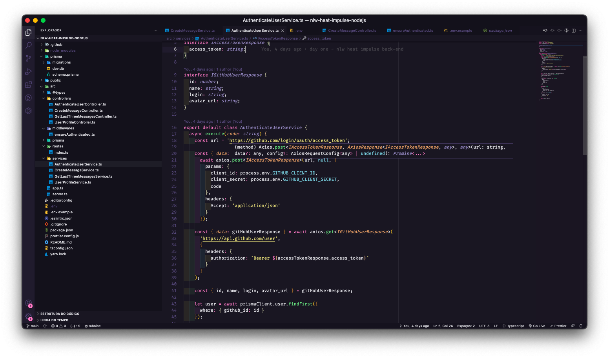

<h1>NLW Heat - Node.js</h1>

  

## ✨ Tecnologias

Esse projeto foi desenvolvido com as seguintes tecnologias:

- [Node.js](https://nodejs.org/en/)
- [Typescript](https://www.typescriptlang.org/)
- [Express](https://expressjs.com/pt-br/)
- [Prisma](https://www.prisma.io/)
- [JSONWebToken](https://github.com/auth0/node-jsonwebtoken#readme)
- [Socket.IO](https://socket.io/)

## 💻 Projeto

Aplicação para se conectar com a comunidade e interagir sobre o evento DoWhile 2021.

## 🚀 Como executar

- Clone o repositório
- Faça uma copia do arquivo `.env.example` para `.env` e preencha com as suas credenciais do GitHub
- Rode `yarn` para baixar as dependências
- Rode `yarn prisma migrate dev` para criar as tabelas do banco de dados.
- Rode o `yarn dev:server` para iniciar a aplicação.

Após isso, a aplicação estará disponível em `http://localhost:4000`
